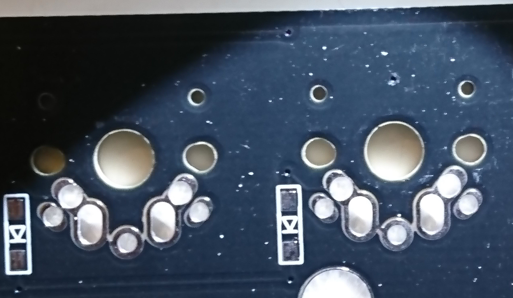
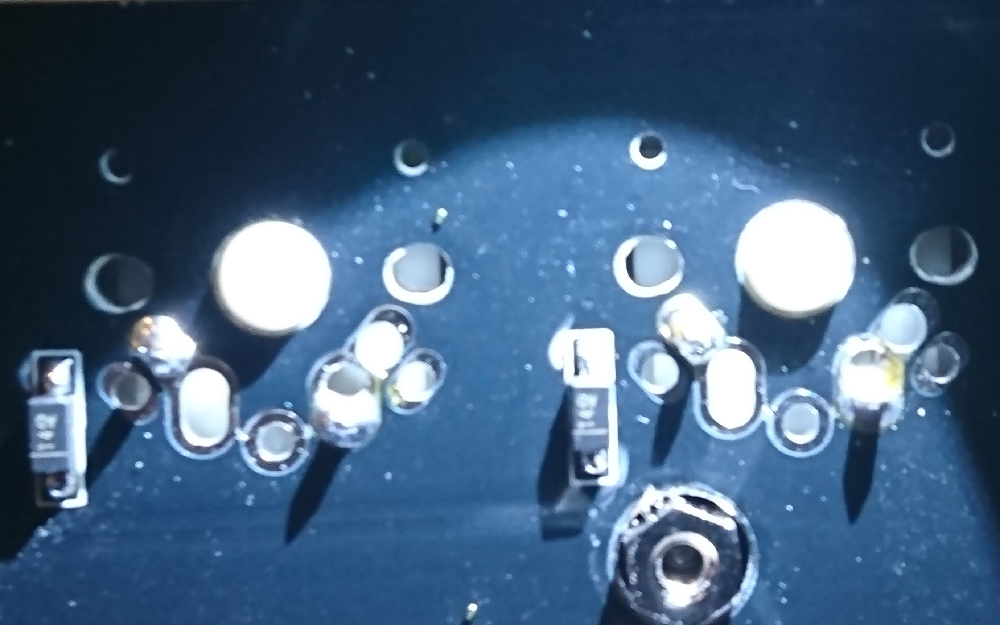
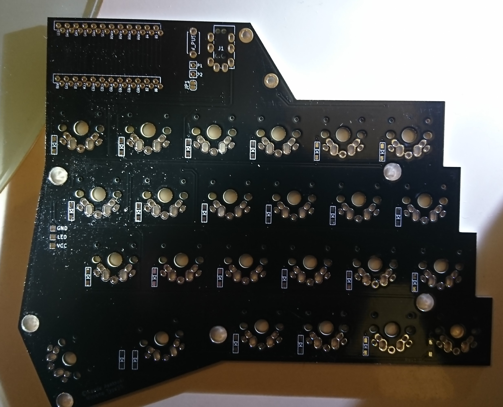
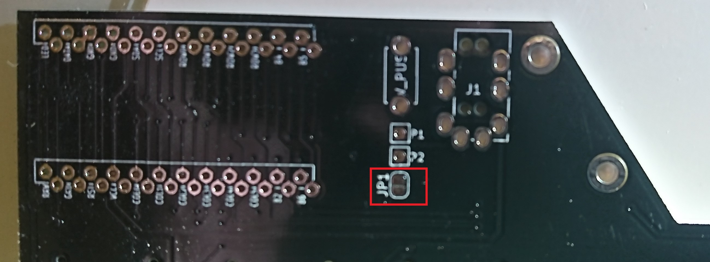
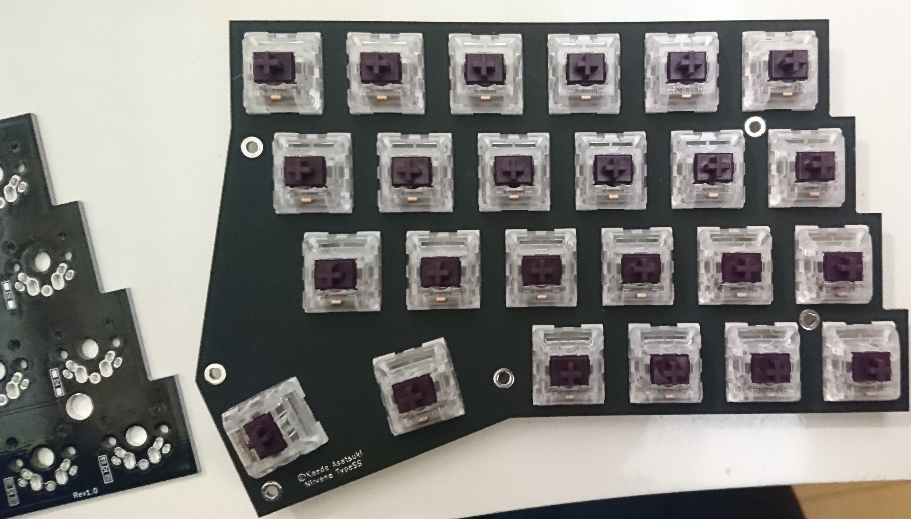
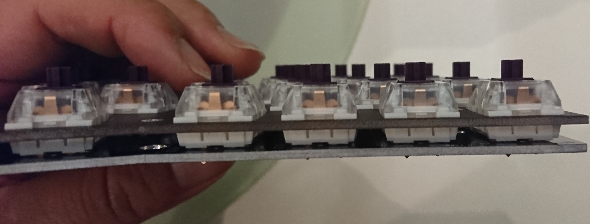
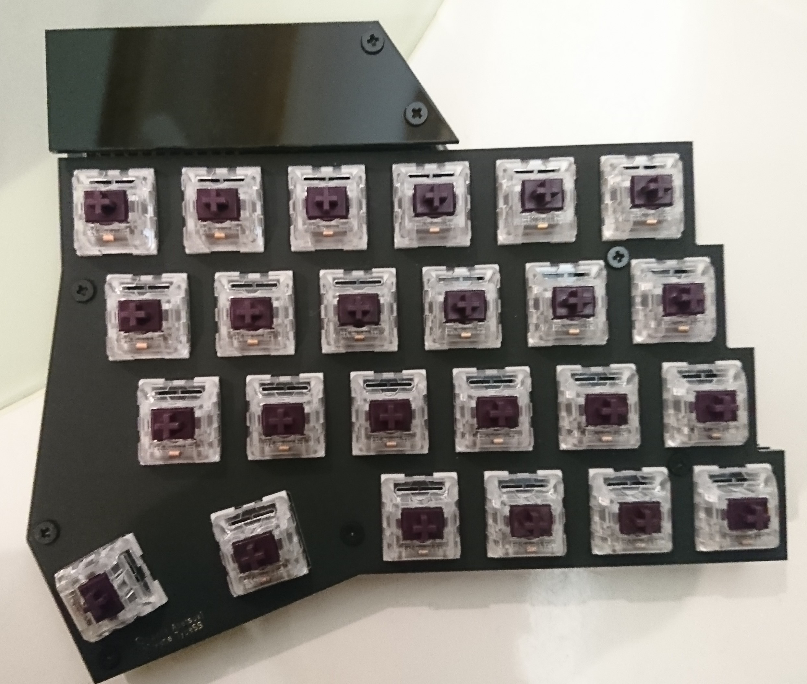
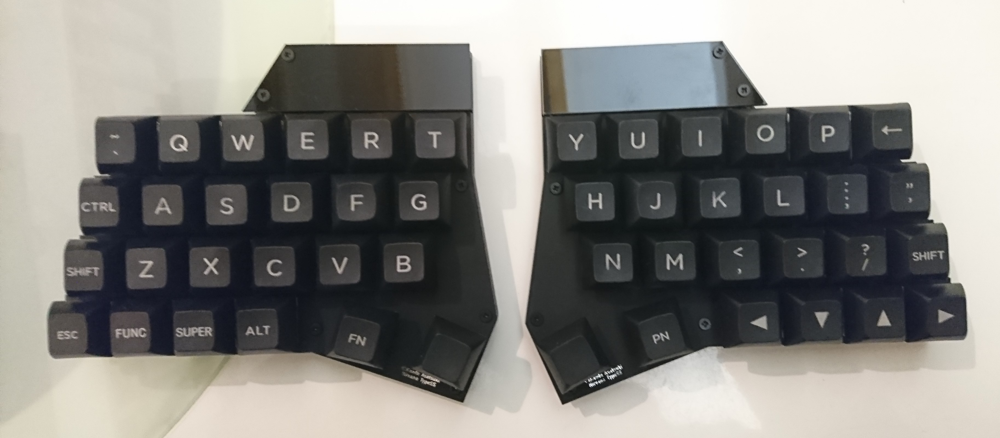

# Nirvana Type-SS ビルドガイド
  
  1. はじめに  
  まず、キットの内容物に不足がないかを確認してください。  
  基盤は、左右共用のため、どちら側に利用するかマスキングテープなどでマーキングすることをお勧めします。 

  1. ダイオードの実装  
  このキットは表面実装ダイオードを基盤裏面へ実装します。  
  片側のパッドにはんだを乗せ、その後にピンセット等でダイオードを取り付けて行き、その後に逆側のパッドをはんだ付けすると、やりやすいかと思います。  
  ダイオードの向きは、写真のような向きとなり、三角に線が入っている側がダイオードの線の入っている側となります。 
   
   
    
  1. JP1のジャンパ  
  基盤の右表側、TRRSジャックのそばに、JP1というジャンパがあるので、ここをはんだでブリッジします。  
  これを実施しないと通信が動かず動作しません。 
   
    
    
  1. TRRSジャック・リセットスイッチの実装  
  基盤の表面にパーツが来るように実装し、はんだ付けします。

  1. promicroの実装  
  コンスルーを利用する場合は、ピンヘッダの向きに注意しながらpromicroとコンスルーを写真のようにはんだ付けし、基盤の表面より差し込みます。  
  promicroとコンスルーのはんだ付けについては  
  [helixビルドガイドのpromicoro項](https://github.com/MakotoKurauchi/helix/blob/master/Doc/buildguide_jp.md)を参考にしてください   
  ピンヘッダを利用する場合は、基盤とピンヘッダ、promicroをはんだ付けします。  
  その後、基盤裏面のはみ出た足をニッパーで切り落とします。  
  この時点で、QMKToolkitなどで、ファームの焼きこみの実施と動作確認を行うことを推奨します。  
  ※qmkのコンパイル環境については[Helixのファームウェアガイド](https://github.com/MakotoKurauchi/helix/blob/master/Doc/firmware_jp.md)を参考に構築してください。  
  nirvanaのリポジトリは[ココ](https://github.com/KaedeAsatsuki/qmk_firmware)からDLしてコンパイルしてください。  
  標準のキーマップの場合  
  $ make nirvana:default  
  でコンパイルできます。
    
  1. マウントプレートへスイッチを組付け  
  写真のように、マウントプレートへスイッチを組み付けます。  
  斜めになってる親指部分のプレートはスイッチにジャストサイズではないため、少し隙間ができますが問題なくはまると思います。 
  

    
  1. スイッチのはんだ付け  
  マウントプレートと基盤をしっかりと合わせ、スイッチをはんだ付けしていきます。  
  プレートと基盤はきっちりはめ込まないと、浮きますので写真のような状態まできっちりとはめ込みましょう。
  
    
  1. LEDの取り付け(オプション)  
  基盤裏面のLED用のパッドにLEDテープをはんだ付けします。  
  この際、LEDテープには向きがあるので間違えないようにしましょう。  
  また、LEDテープによってはパッドと幅が合わない場合があります。  
  その場合は、リード線を引いて取り付けてください。  
  ※LED装着時は、QMKファームウェアの./keyboards/nirvana/keymaps/利用するキーマップ/rukes.mkのRGBLIGHT_ENABLEをyesに変えてコンパイルしてください。

    
  1. promicro保護用のアクリルプレートの取り付け  
  promicro保護用のアクリルプレートをスペーサーとねじを利用し固定します。  
    
  1. ボトムプレートと基盤・マウントプレートを組み付ける  
  ねじ、スペーサーを利用し、マウントプレート・ボトムプレートを固定します。  
  その後、ゴム足をボトムプレートに張り付けます。 
    

  1. キーキャップの装着
  左右ともに組付けが終わったらキーキャップをはめて完成です。  
  
